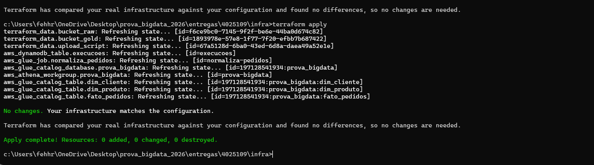
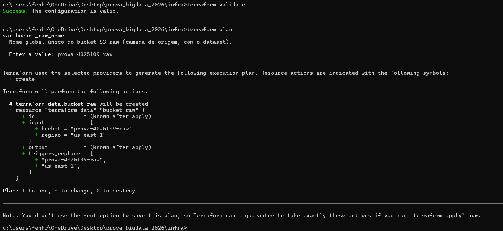
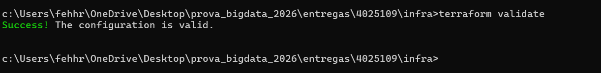
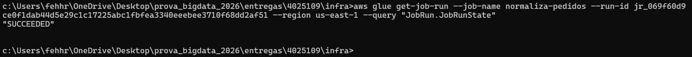
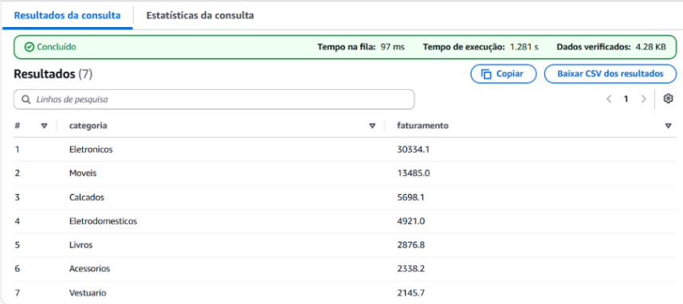
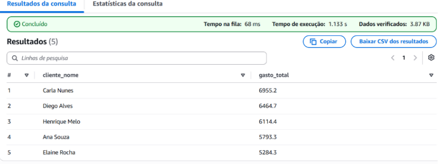
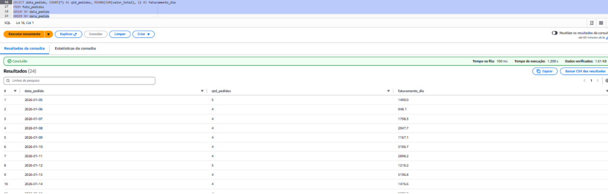
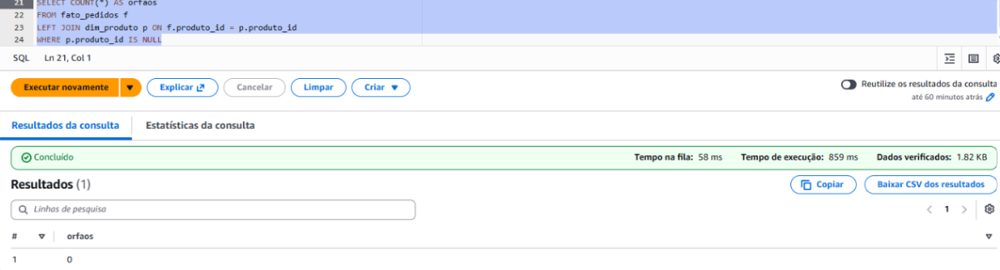
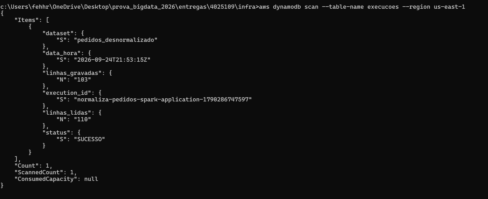
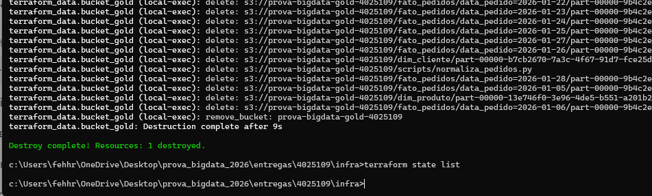

# Evidências de execução — RA 4025109

Esta pasta reúne os prints/evidências exigidos como entregáveis da prova
(Terraform, consultas Athena e item no DynamoDB).

Salve cada print nesta pasta com o nome indicado abaixo.

## Provisionamento (Terraform)

- `terraform-apply.png` — saída final do `terraform apply` (Apply complete!).

## Glue Job

- `glue-job-succeeded.png` — status `SUCCEEDED` do Job `normaliza-pedidos`.

## Camada gold (Parquet particionado)

- `s3-fato-particionado.png` — `aws s3 ls` do `fato_pedidos/` mostrando as
  partições `data_pedido=YYYY-MM-DD/`.

## Consultas Athena de referência

- `04-athena-consulta1-faturamento-categoria.png` — Consulta 1.

- `athena-consulta2-top5-clientes.png` — Consulta 2.

- `athena-consulta3-pedidos-por-dia.png` — Consulta 3.

- `athena-consulta4-integridade.png` — Consulta 4 (orfaos = 0).

## Metadados no DynamoDB

- `dynamodb-item-execucao.png` — item da tabela `execucoes` com
  `execution_id`, `data_hora`, `dataset`, `linhas_lidas`, `linhas_gravadas`
  e `status = SUCESSO`.

  

## Limpeza (ao final)

- `terraform-destroy.png` — saída do `terraform destroy` (Destroy complete!).
