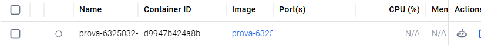

# Validação local — 24/09/2026

- Terraform 1.15.8; validação local original rodou com provider AWS 6.66.0.
  Corrigido depois para a versão exigida pelo professor (5.31.0, ver `versions.tf`);
  o `.terraform.lock.hcl` foi removido e precisa ser regenerado com `terraform init`
  usando essa versão antes do `apply` na conta real.
- `terraform init -backend=false -input=false`: concluído (com o provider 6.66.0, antes da correção).
- `terraform validate`: configuração válida.
- Docker com Python 3.11, Java 17, PySpark 3.5.1 e pytest 8.2.2.
- **10 testes aprovados em 53,77 segundos**, incluindo uma propriedade com 100 exemplos gerados pelo Hypothesis.
- Leitura do CSV real: 110 linhas; fato com 103; 16 clientes; 8 produtos; 24 datas.
- Faturamento: R$ 61.798,90; integridade de clientes e produtos preservada.
- As quatro consultas SQL foram comparadas localmente com resultados calculados de forma independente.
- Parquet gravado e relido em disco; reexecução com menos datas removeu partições antigas.
- Falha na escrita e falha simultânea no registro DynamoDB testadas com simulação, sem acessar AWS.
- Dataset preservado byte a byte. SHA-256: `e66092c10eb21b9d52643e023c6b37140f5d7536ad6c3e97bc364c5c7f1565aa`.

Essas verificações não comprovam permissões do Learner Lab nem substituem
`terraform apply`, execução Glue, Athena, DynamoDB e `terraform destroy` reais.
O arquivo PENDENCIAS_AWS.md lista as evidências que ainda precisam ser obtidas.

             

