# Entrega — Prova Prática de Big Data na AWS

| | |
|---|---|
| **Aluno** | Sirlande Martins de Oliveira Junior |
| **RA** | 6325269 |
| **Branch** | `prova-6325269` |
| **Disciplina** | Big Data (UNIFAAT) |
| **Execução na AWS** | 28/09/2026 — AWS Academy Learner Lab, região `us-east-1` |

## 1. Visão geral

Pipeline **raw → gold** na AWS, provisionado 100% com Terraform:

```
CSV desnormalizado ──► Bucket_Raw (S3) ──► Glue Job PySpark ──► Bucket_Gold (Parquet particionado)
                                                  │                        │
                                                  ▼                        ▼
                                     DynamoDB (metadados)     Glue Data Catalog ──► Athena (SQL)
```

O Glue Job lê o CSV com 110 linhas, descarta as linhas inválidas, normaliza em **esquema estrela**
(`fato_pedidos` + `dim_cliente` + `dim_produto`), grava em Parquet no gold (fato particionado por
`data_pedido`) e registra os metadados da execução no DynamoDB.

## 2. Estrutura da pasta

```
entregas/6325269/
├── README.md                        # este arquivo
├── dataset/pedidos_desnormalizado.csv
├── glue-job/normaliza_pedidos.py    # Job PySpark (TODOs implementados)
├── infra/
│   ├── raw.tf, versions.tf          # do professor, sem alteração
│   ├── variables.tf                 # + variáveis da camada gold
│   ├── terraform.tfvars.example     # modelo sem segredos
│   ├── gold.tf                      # bucket gold, script, DynamoDB, Glue Job, Catalog, Athena
│   └── outputs.tf                   # nomes usados nos comandos da execução
└── evidencias/                      # prints e logs (seção 7)
```

## 3. Mapa da rubrica

| Critério | Pts | Onde está a prova |
|---|---:|---|
| 1. Terraform aplica sem erro | 20 | `01-terraform-apply` — 10 recursos criados, 0 erros |
| 2. Normalização (fato + 2 dimensões) | 25 | Seção 6 (103 / 21 / 8) e consultas 1, 2 e 4 (sem `DESCONHECIDO` indevido, 0 órfãos) |
| 3. Parquet particionado por `data_pedido` | 15 | `03a`/`03b` — 24 partições com 1 Parquet cada |
| 4. Consultas Athena | 15 | `04` a `07` — as 4 consultas de referência |
| 5. Metadados no DynamoDB | 10 | `08-dynamodb-item` — 110 / 103 / `SUCESSO` |
| 6. Custo/limpeza e segurança | 15 | Seção 9 e `09a`/`09b` — destroy com 10 recursos removidos |

## 4. Decisões de design

| # | Decisão | Escolha | Por quê |
|---|---|---|---|
| D1 | Schema na leitura do CSV | **Schema explícito** (`RAW_SCHEMA`), sem `inferSchema`, modo `PERMISSIVE` | O fato exige `date` e `int`. Com schema fixo, os tipos não dependem dos dados, e um valor que não converte vira nulo só naquele campo (a linha é descartada pelo filtro). |
| D2 | Deduplicação das dimensões | `groupBy` pela chave (com `trim`) + **`max`** em cada texto; só no fim, nulo → `DESCONHECIDO` | O dataset tem conflitos: `PRD072` aparece sem categoria (PED0105) e `PRD084` sem nome (PED0104). Um `dropDuplicates` escolheria qualquer linha, e a Consulta 1 poderia ganhar uma categoria `DESCONHECIDO`. O `max` ignora nulos e é determinístico: usa o valor conhecido quando existe. |
| D3 | Fonte das dimensões | **Todas as linhas com chave presente**, inclusive as descartadas do fato | Não perde clientes/produtos válidos. A integridade fato → dimensão continua garantida (Consulta 4 = 0). |
| D4 | Registro no Glue Catalog | **Tabelas explícitas** (`aws_glue_catalog_table`) + **partition projection** em `data_pedido` | 100% IaC, tipos iguais aos do Parquet, sem Crawler e sem `MSCK REPAIR` depois do Job. |
| D5 | Upload do script | `terraform_data` + `aws s3 cp`, com o hash do `.py` em `triggers_replace` | Mesmo padrão do `raw.tf` (o Learner Lab nega `aws_s3_bucket`). Mudar o script refaz o upload. |
| D6 | Destroy limpo | Bucket gold removido com `aws s3 rb --force`; workgroup com `force_destroy = true` | O destroy apaga os Parquet e os resultados do Athena sem passo manual (comprovado em `09a`/`09b`). |
| D7 | Glue econômico | Glue **5.0**, `G.1X` × **2** workers, `timeout = 10`, `max_retries = 0`, bookmark desligado | Menor configuração permitida. A execução levou 1 min 14 s (0,04 DPU-hora). |

Outras escolhas relevantes:

- **Filtro do fato:** descarta linhas sem `pedido_id`, `cliente_id` ou `produto_id` (nulo, vazio ou só
  espaços) e com `quantidade` nula ou `<= 0`. Chaves passam por `trim`.
- **Escrita:** `mode("overwrite")` nas 3 tabelas — reexecutar o Job não duplica dados. O fato usa
  `repartition("data_pedido")` (1 arquivo por partição); as dimensões usam `coalesce(1)`.
- **Falha:** se algo der errado, o Job grava um item `FALHA` no DynamoDB (com `linhas_lidas` real) e
  relança o erro **original**, para o console do Glue mostrar a causa raiz.
- **Nomes:** Job `job-gold-6325269`, tabela `execucoes-6325269`, database `gold_6325269`,
  workgroup `wg-gold-6325269`, bucket `prova-bigdata-gold-6325269`.

## 5. Como executar

Pré-requisitos: Terraform ≥ 1.5, AWS CLI v2 e credenciais do Learner Lab em `~/.aws/credentials`
(com `aws_session_token`).

```bash
cd entregas/6325269/infra

# 1. Variáveis: copiar o modelo e preencher o ARN real da LabRole
cp terraform.tfvars.example terraform.tfvars
aws iam get-role --role-name LabRole --query Role.Arn --output text   # colar em labrole_arn

# 2. Infra
terraform init
terraform apply

# 3. Rodar o Job — SÓ com --job-name (os argumentos já estão no Job)
aws glue start-job-run --job-name "$(terraform output -raw glue_job_nome)"
aws glue get-job-run --job-name "$(terraform output -raw glue_job_nome)" \
  --run-id <JobRunId> --query JobRun.JobRunState

# 4. Conferir o gold
aws s3 ls "$(terraform output -raw gold_path)" --recursive

# 5. Metadados
aws dynamodb scan --table-name "$(terraform output -raw dynamodb_tabela_nome)"

# 6. Limpar tudo
terraform destroy
```

> ⚠️ Não use o `start-job-run` com `--arguments` do README da prova (§7): ele sobrescreve o
> `--DDB_TABLE` com uma tabela que não existe, e o Job falha depois de gravar o gold.

**Athena:** no *Editor de consultas*, selecione o grupo de trabalho **`wg-gold-6325269`** e o banco
de dados **`gold_6325269`** (o workgroup não tem banco padrão). Pela CLI:
`--work-group wg-gold-6325269 --query-execution-context Database=gold_6325269`.

## 6. Resultados × esperado

| Métrica | Esperado | Obtido |
|---|---|---|
| Linhas lidas do raw | 110 | **110** |
| Linhas descartadas do fato | 7 | **7** |
| Linhas no `fato_pedidos` | 103 | **103** |
| Partições `data_pedido=` | 24 (05/01 a 28/01/2026) | **24** |
| `dim_cliente` / `dim_produto` | 21 / 8 | **21 / 8** (testes locais com o mesmo código) |
| `SUM(valor_total)` do fato | 61798.90 | **61798.9** |
| Consulta 1 — faturamento por categoria | 7 categorias, Eletronicos no topo (30334.10) | **Idêntico**, sem `DESCONHECIDO` |
| Consulta 2 — top 5 clientes | Carla Nunes 6955.20 … Elaine Rocha 5284.30 | **Idêntico** |
| Consulta 3 — pedidos por dia | 24 linhas, soma de `qtd_pedidos` = 103 | **24 linhas, soma 103** |
| Consulta 4 — órfãos | 0 | **0** |
| Item no DynamoDB | 110 / 103 / `SUCESSO` | **110 / 103 / `SUCESSO`** |

## 7. Evidências

**Terraform apply** — 10 recursos criados e os outputs ([log completo](evidencias/01-terraform-apply.log))

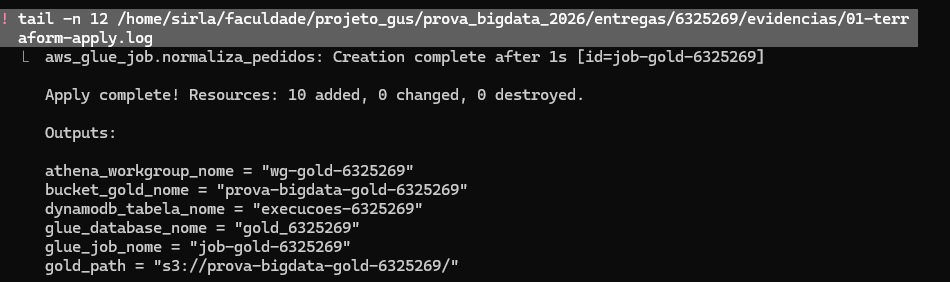

**Glue Job** — `Succeeded` em 1 min 14 s, Glue 5.0, G.1X, 2 DPUs

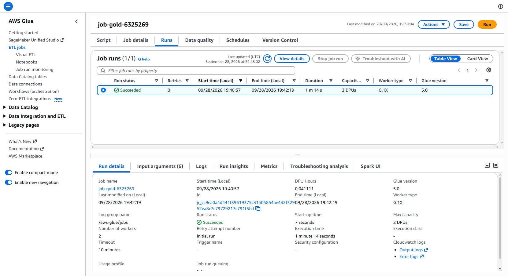

**Bucket gold** — 24 partições `data_pedido=` + `dim_cliente/` + `dim_produto/` ([listagem](evidencias/03-s3-gold-layout.log))

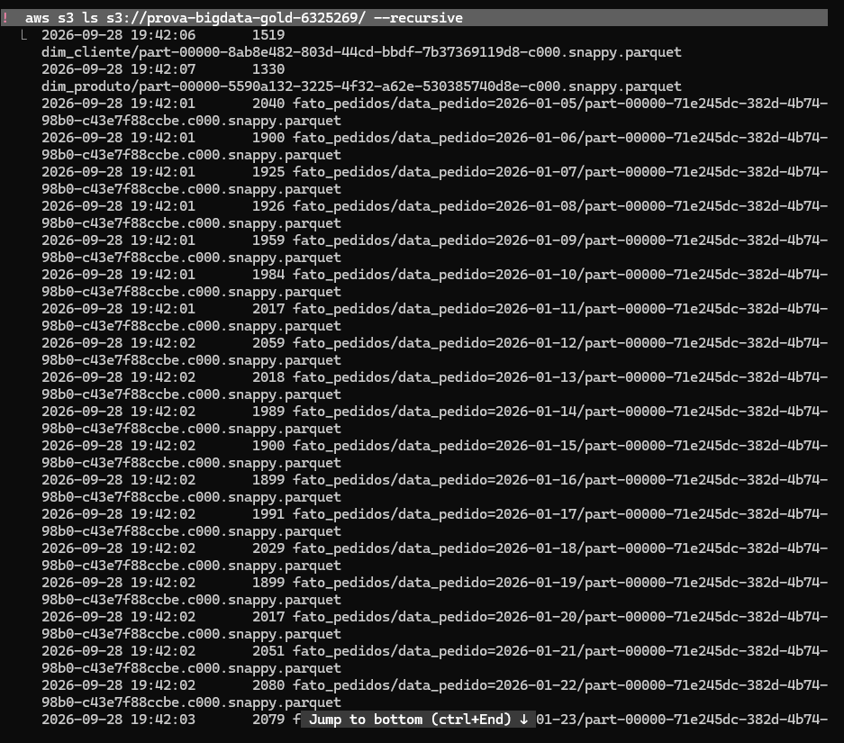
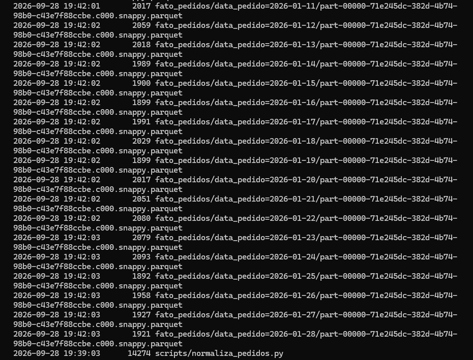

**Consulta 1** — faturamento por categoria

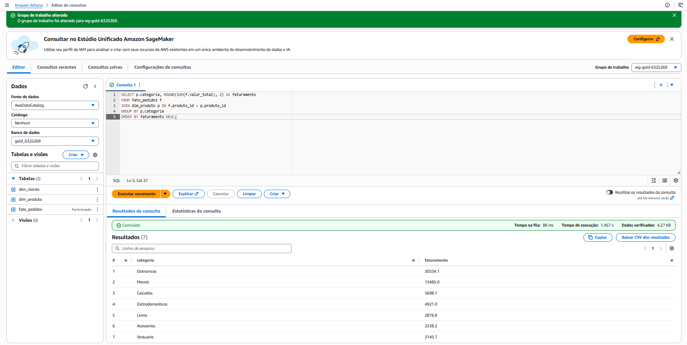

**Consulta 2** — top 5 clientes

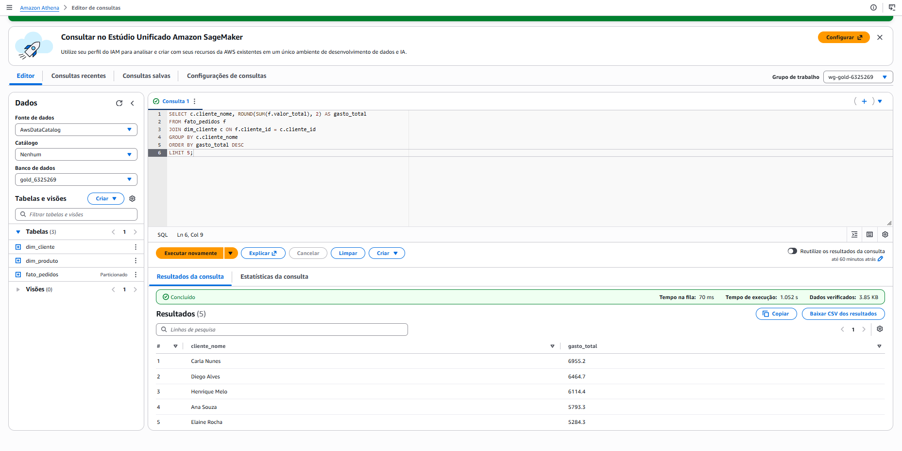

**Consulta 3** — pedidos e faturamento por dia (24 partições)

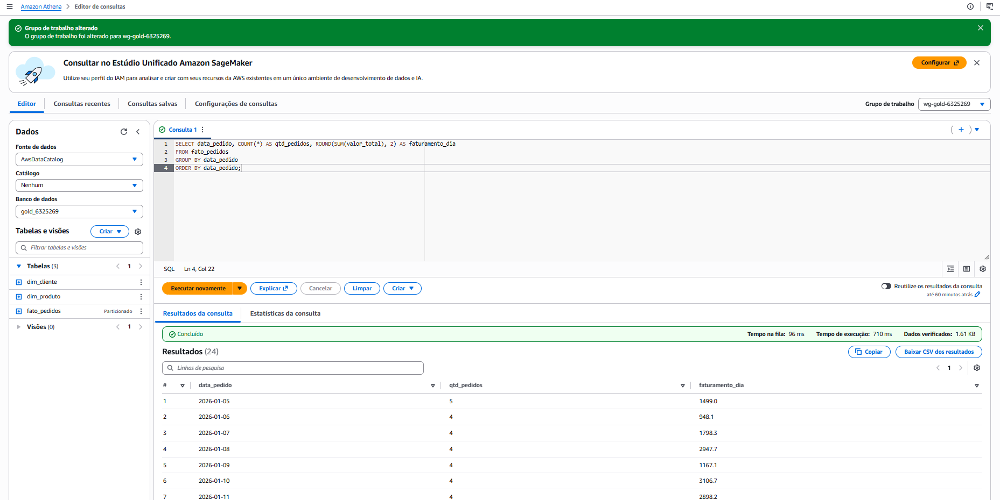
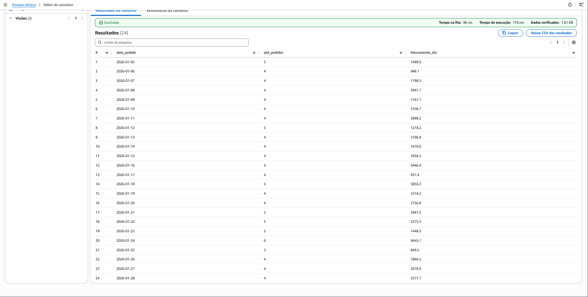

**Consulta 4** — integridade referencial (órfãos = 0)

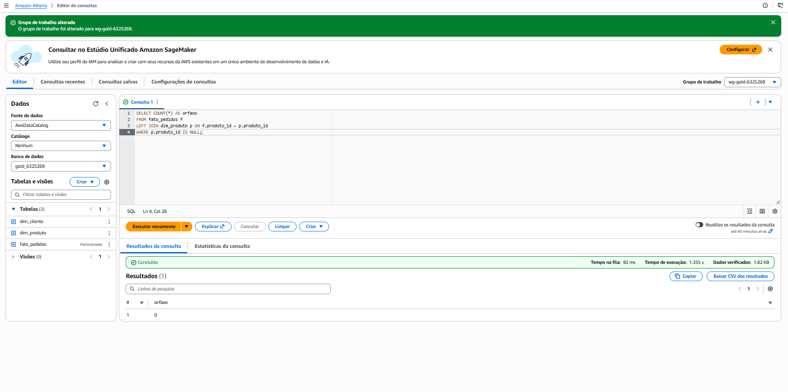

**DynamoDB** — item da execução ([saída do scan](evidencias/08-dynamodb-item.log))

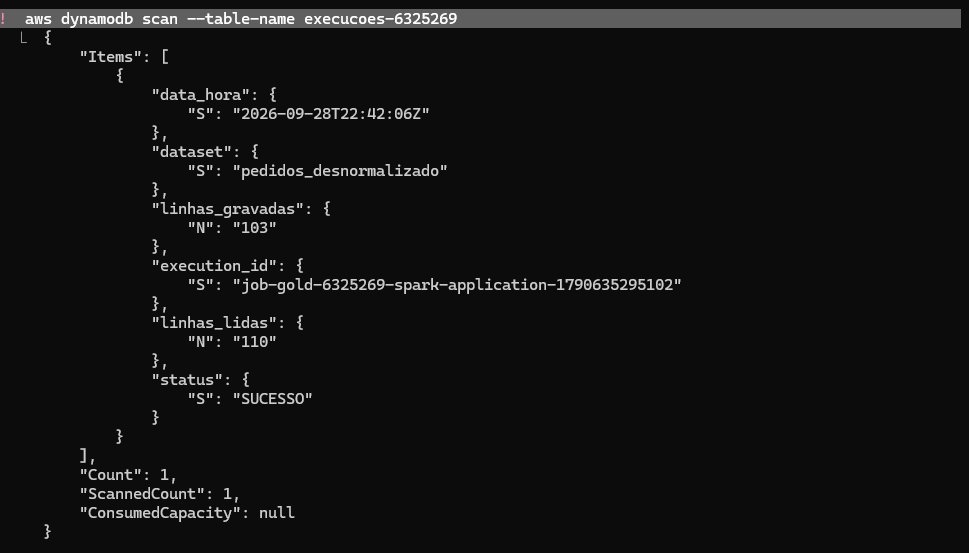

**Terraform destroy** — 10 recursos removidos e nenhum bucket da prova restante ([log](evidencias/09-terraform-destroy.log))

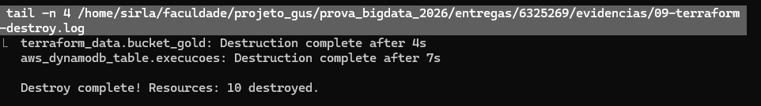
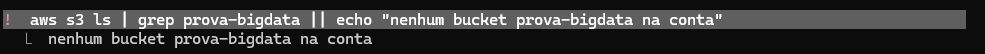

## 8. Ressalvas e limitações

- **`coalesce(1)` e sem `cache()`:** adequados porque o volume é pequeno (110 linhas). Com volume
  grande, `coalesce(1)` concentraria a escrita num único executor e valeria usar `cache()` no
  DataFrame lido, que é reutilizado na contagem e na normalização.
- **`execution_id`:** é `job-gold-6325269-spark-application-<timestamp>` (ID da aplicação Spark),
  não o `JobRunId` (`jr_…`) exibido no console do Glue. É único por execução, mas não liga
  diretamente a um run do console.
- **Tags:** as 3 tags (`Projeto`, `Disciplina`, `Ambiente`) estão em **todos os recursos criados
  nesta entrega** (bucket gold, DynamoDB, Glue Job, database e workgroup); o bucket gold recebe as
  tags via `put-bucket-tagging`. O bucket raw é do professor (`raw.tf`, não alterado) e
  `aws_glue_catalog_table` não suporta tags.
- **Mudar tags do bucket gold** depois de criado exige `terraform apply -replace=terraform_data.bucket_gold`
  (o provisioner só roda na criação). **Trocar `bucket_gold_nome`** apaga o bucket antigo com tudo;
  os dados só voltam rodando o Job de novo.
- **Criptografia:** o bucket gold usa SSE-S3, padrão de todo bucket novo desde 2023; os resultados
  do Athena também são gravados com SSE-S3.
- **Outputs:** usam o atributo do recurso (ex.: `aws_glue_job.normaliza_pedidos.name`). O plan já
  mostra o valor, porque o nome vem da configuração; a vantagem é a dependência: no apply, o output
  só é gravado depois que o recurso foi criado com sucesso.

## 9. Segurança e custo

- **Credenciais:** nunca versionadas. `terraform.tfvars`, `*.tfstate` e `credentials` estão no
  `.gitignore`; só o `terraform.tfvars.example` vai para o repositório.
- **IAM:** nenhuma role ou policy criada. O Glue Job usa a **LabRole** por ARN (`var.labrole_arn`,
  validado por regex).
- **Buckets privados:** os 4 bloqueios de acesso público ativos no gold, como no raw.
- **Prints:** nenhum mostra ID de conta, ARN real ou credencial (o print da Consulta 4 foi recortado
  para remover a barra da conta). Os logs têm o número da conta trocado por `<conta>`.
- **Custo:** Glue com a configuração mínima (74 s), DynamoDB `PAY_PER_REQUEST`, Athena com limite de
  10 MB por consulta (as consultas leram menos de 5 KB) e **`terraform destroy` ao final**, com os
  recursos conferidos como inexistentes na AWS.

## 10. Uso de IA

Usei um assistente de IA (Claude) como guia durante a prova:

- Para cada tarefa, o assistente apresentou uma tabela de decisões com recomendações; eu questionei
  e aprovei cada uma.
- O código do Job (`normaliza_pedidos.py`) e do Terraform (`variables.tf`, `gold.tf`, `outputs.tf`)
  foi **escrito por mim**, a partir de explicações e exemplos em outro domínio. O assistente revisou,
  testou localmente e corrigiu apenas formatação (indentação, espaços, quebras de linha).
- A execução na AWS (apply, Job, consultas de conferência, destroy) foi conduzida junto com o
  assistente; os prints do console e do terminal foram tirados por mim.
- **Este README foi redigido pelo assistente, a meu pedido, e revisado por mim.**
